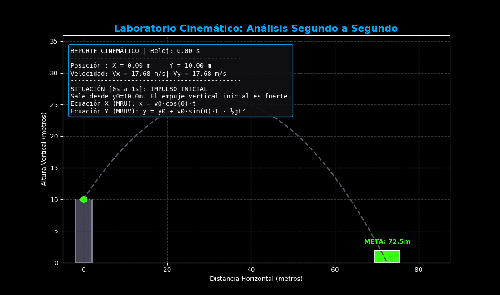
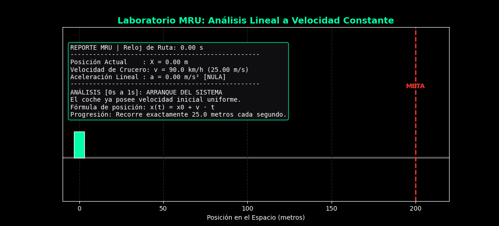
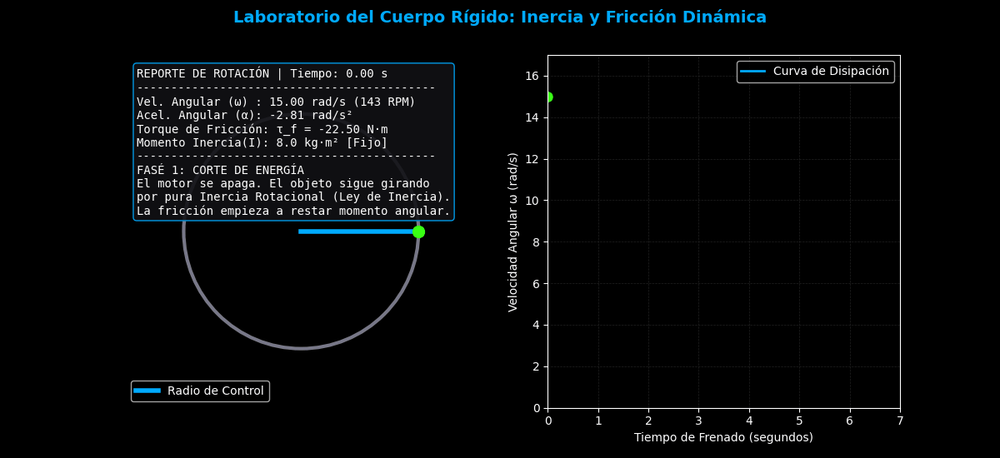

#  Laboratorio de Simulaciones Físicas

Este proyecto es un conjunto de simulaciones interactivas y analíticas desarrolladas en Python. Está diseñado para visualizar y comprender fenómenos físicos aplicados a la ingeniería mediante dos enfoques:
1. **Motores Interactivos en Tiempo Real** (Usando Pygame).
2. **Generación de Reportes Analíticos Animados** (Usando Matplotlib y NumPy).

## 📂 Estructura del Proyecto

El proyecto está dividido en tres módulos principales de física:

### 1. Cinemática del Punto (Tiro Parabólico)
Simula el movimiento de un proyectil sujeto a la gravedad terrestre ($g = 9.81 m/s^2$). Permite ajustar la velocidad inicial ($v_0$), el ángulo de disparo ($\theta$) y la altura inicial ($y_0$) para alcanzar una meta específica.
- **Interactivo:** Ejecuta `python cinematica_punto/main.py`
- **Render GIF:** Ejecuta `python cinematica_punto/generar_gif_final.py`



---

### 2. Movimiento Rectilíneo Uniforme (MRU)
Demostración de un vehículo desplazándose a velocidad constante (sin aceleración). Incluye conversión de unidades (km/h a m/s) y telemetría de distancias en un entorno carretero.
- **Interactivo:** Ejecuta `python mru/main.py`
- **Render GIF:** Ejecuta `python mru/mru_laboratorio_lento.py`



---

### 3. Dinámica de Cuerpo Rígido
Simulador de un motor industrial/rotor. Aplica la Segunda Ley de Newton para rotación ($\alpha = \tau / I$). Muestra cómo el torque vence a la fricción y cómo la inercia mantiene el giro cuando el motor se apaga.
- **Interactivo:** Ejecuta `python cuerpo_rigido/main.py`
- **Render GIF:** Ejecuta `python cuerpo_rigido/rigido_laboratorio_lento.py`



---

## ⚙️ Instalación y Uso

1. **Clonar el repositorio:**
   ```bash
   git clone https://github.com/hernandezhernandezlizeth1-sketch/simulaciones-cinematica.git
   cd simulaciones-cinematica

# Cómo correrlo
1. Crea tu entorno virtual: `python -m venv venv`
2. Actívalo (Windows: `venv\Scripts\activate` | Linux/Mac: `source venv/bin/activate`)
3. Instala dependencias: `pip install -r requirements.txt`
4. Ejecuta cada simulación entrando a su carpeta y corriendo el `main.py`.
